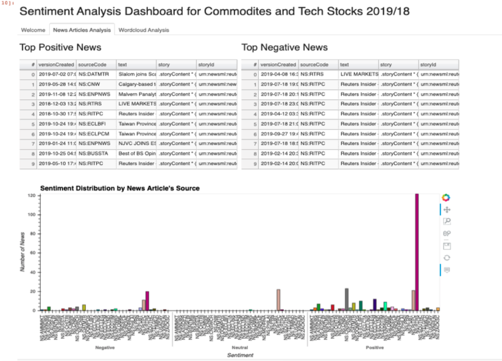
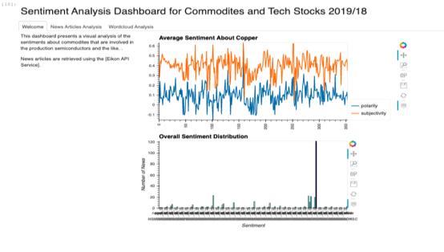

## Project: Deep Learning Analysis of Commodities & Supply Chain Management:

  * [Project: Deep Learning Analysis of Commodities & Supply Chain Management:](#project--deep-learning-analysis-of-commodities---supply-chain-management-)
  * [Reasearch](#reasearch)
  * [Howe we make money?](#howe-we-make-money-)
    + [Technical Requirements](#technical-requirements)
- [Simple Linear Regression Models, ARMA, ARIMA, GARCH:](#simple-linear-regression-models--arma--arima--garch-)
- [Deep Learning Model:](#deep-learning-model-)
  * [Model Without NLP](#model-without-nlp)
  * [Model with NLP](#model-with-nlp)
    + [Linear Regression](#linear-regression)
    + [Predicted Deep Learning](#predicted-deep-learning)
    + [Tensorboard](#tensorboard)
  * [Sentiment Analysis Dashboard](#sentiment-analysis-dashboard)

In this project we evaluate metal commodities used in the production of SemiConductor and Chip manufacturing. With our deep
learning algo  we aim  to help stock investors in their decision making around investments in technology stocks, using NLP alternative data to seperate ourselves from the competitors.
This allows them to have different type of approach in understanding  and analysing the data using  the information from supply chain companies.
The team developed an interest in evaluating supply chain companies used by Intel LLC. 
After obtaining as much data as we had, the team found that there is strong correlation between commodity prices and tech company stock prices.

We believe that the systematic study of the movement in prices of businesses that comprise the supply chain of a certain company can lead to predicting the stock's price of this very company. Since a supply chain is "A network between a company and its suppliers to produce and distribute a specific product to the final buyer. This network includes different activities, people, entities, information, and resources". We believe that we can estimate  what is happening at "certain point on a river by seeing what is happening upstream and downstream". If the biggest clients of a certain company are not performing so well, it could be expected, at least in the short term that their biggest supplier will suffer undesirable consequences. What effect could have on a business the fact that their biggest suppliers are having trouble, because lets say, the procure of certain commodity is becoming more expensive due to climate or political unrest in a certain country, and this commodity is essential for the manufacture of an element that is needed for a final product. As an example, Silicon to manufacture semiconductors that are needed to build a laptop. We could then consider this as a fundamental analysis with an approach towards the supply chain, were we understand clearly how the pieces are connected. We propose building machine learning models were the features are the pieces that constitute the supply chain of a company that we take as the target. We are offering an alternative for prices forecasting that can give an edge for equities pricing using Machine Learning.

To test our Deep Learning model we used the company Intel as our target. the features were as follows:

- Suppliers: Applied Materials, Taiwan Semiconductor Manufacturing.
- Distributors: Arrow Corporation, Avnet, inc, Synnex Corporation.
Clients: Dell, HP, Lenovo

We also wanted to test the model against an analysis were the features are stock's closing prices for companies that are direct competitors to Intel: Advanced micro Devices, NVIDIA, Qualcomn, Broadcom, Micron Technologies and Texas Instruments. We set off our model to predict the closing price of Intel using historic prices from these competitors and compared the results with the supply chain analysis by calculating the correlation between predicted prices and real prices for both analyses. Also, in parallel to the Neural Network we ran a Machine learning regression algorithm to also have a comparison between model's outcomes for reference during our testing.

For the Neural Network we optimized our hyper-parameters by trial an error, until we found a set up that would minimize error without over or under-fitting the model without taking to much computational time.

We then added a third layer of NLP sentiment to our model. However, due to data consitrictions we were only able to pull about a year and a half. However, we did see positive results and with more complete data overtime can pull further trends. Also, which targets and testing data can also be determined later to specifiy specific stocks. We gathered as many datapoints as we could to learn.

This can also be used for Algotrading with further fine-tuning and larger data sets. 
- - - 

## Reasearch 

Understanding the problems: 
    
1. Understanding the commodities prices and the impact of the price changes into overall technology sector stock price  formation.
2. Understanding the impact of the price changes in tech company supply chain companies and how that influence on the price formation of the stock price
3. Understanding the  impact of the news related to commodities on price of the technology company stock prices.

Commodity prices can be exceptionally volatile, creating opportunities for traders to profit by going long or short on these markets.
Mother Nature - Weather determinants - weather data is really exuberant. We can do a cool model here with this. 
Supply & Demand - Every area produces certain product. We can focus on an area where demand is high and supply is low, visa versa???
Geopolitics - currently we are facing trade tariffs because of Trumps enforcements. Can we see what effect this will have on trading? 
Leverage - trading on the futures market. Trader normally only has to post 5% to 15% of the contract value in futures margin value to control investment in the total contract value. 
Ex: price of crude oil is trading at $82 a barrel and crude oil futures contract is for 1,000 barrels, the total value of the futures contract is $82,000. A trader might only have to post about $5,100 to control $82,000 worth of crude oil. For every $1 that crude oil moves, that trader could potentially earn or lose $1,000 per contract held.
Liquidity 
an activity is a function of price action. While some markets like gold and crude oil always attract a high number of market participants, lumber and frozen concentrated orange juice futures tend to always suffer from liquidity problems. Other commodities come into and go out of fashion over time. The supply and demand fundamentals for commodities can change liquidity. As an example, if there is a sudden shortage of a commodity and the price begins to move higher, it will attract speculative buying. 

On the other hand, if a market is suddenly hit with a huge supply, speculative selling will often appear. In both of these cases, volume and open interest are likely to rise.

In the world of commodities trading and investing, macroeconomic forces also play a role in liquidity. The great bull market in commodities that commenced in 2002 and lasted until 2012 attracted a great deal of interest to all raw material markets. Additionally, the advent of new products, ETFs, and ETNs, brought new market participants to markets. Prior to the introduction of these market vehicles, the only potential for trading and investing could be found in the physical or futures markets. ETF and ETN products increased volume and open interest in the futures markets as administrators, managers and issuers of these products often use the futures exchanges to hedge risks associated with the new products that trade on traditional equity exchanges. Additionally,the ETF and ETN products create the ability for arbitrage or spreading futures against the ETF/ETN vehicles to take advantage of price discrepancies.

Comparing current volume and open interest numbers to historical levels will help you to understand if a market offers both the potential and the liquidity necessary to make it a candidate for your trading and investing pursuits.

Semiconductors are materials with tunable electrical conductivity. Semiconductors are an engineering marvel — hardly any semiconductor is useful in its natural form. Numerous growth, processing and finishing steps convert the raw material to the carefully-designed functional device with the targeted electrical and optical properties.

The first modern transistor was made out of Germanium  (Bell Labs, 1947). Silicon is the most common semiconductor, dominating the digital data processing market (computer chips) as well as the photovoltaics industry (solar panels).
Other commercial semiconductors are SiC, the "3-5s" (GaP, InSb, AlGaAs, GaN, etc), organic semiconductors (e.g., pentacene) and more. 

Raw materials must be cleaned extensively and grown into a single crystal with as few defects as possible. The pure semiconductor is an electrical insulator. Through a process called "implantation" the material is made impure again, but in a controlled manner. These exogenous atoms impart electrical conductivity to the whole crystal

https://mse.umd.edu/about/what-is-mse/semiconductors
https://www.thebalance.com/the-most-actively-traded-commodities-809314

## Howe we make money?
The objective of the project is to design a solution using machine learning, deep learning models that will  help potential investors to take better decision in technology companies stock investing using  supply chain approach.
- PAAS - Offering a full platform as a service would be ideal in our situation. With more time and funding we plan to add a Algo Bot to help execute trades. However, utilizing our metrics is ideal for now.

- NLP - reading in newssentiment and evaluating per stock basis. This can have a significatn impact when major news hits the markets. 
    - Our NLP algo allows to also translate documents in the future for companies, while our  clients pull data. similar to DuoLingo. 
    -  With an added API feature, we can scrape real-time data to provide real time-reporting. As well as, evaluate more shipping contracts and futures commodities. 

- - -
### Technical Requirements
1. Create a Jupyter Notebook, Google Colab Notebook, or Amazon SageMaker Notebook to prepare a training and testingdataset.
2. Optionally, apply a dimensionality reduction technique to reduce the input features, or perform feature engineering togenerate new features to train the model. Create one or more machine learning models.
3. Fit the model(s) to the training data.
4. Evaluate the trained model(s) using testing data. Include any calculations, metrics, or visualizations needed to evaluatethe performance.
5. Show the predictions using a sample of new data. Compare the predictions if more than one model is used.
6. Save PNG images of your visualizations to distribute to the class and instructional team and for inclusion in yourpresentation and your repo's README.md file.
7. Use one new machine learning library, machine learning model, or evaluation metric that hasn't been covered in class.
Create a README.md in your repo with a write-up summarizing your project. Be sure to include any usage instructionsto set up and use the model

- - - 
# Simple Linear Regression Models, ARMA, ARIMA, GARCH:

For Time Series and Linear Regression, we selected data from Yahoo finance and Nasdaq. Overall, we have the prices of most commodities used in semiconductor manufacturing and some tech companies stock prices for the last 5 years.

.png)

# Deep Learning Model: 

We use K-fold validation to ensure that the test sample that we are using is not too contrasting from our test sample in terms of variance.

To measure the performance of our model we plotted the mean absolute error vs the number of epochs, to check how the average of the absolute differences between target values and the predictions evolve with the epochs. As shown bellow

## Model Without NLP 

We also compared the loss with the number of epochs, for train and validation, so that we know depending on how both curves are interacting, if we are under-fitting, overfitting or setting up our model just right. While training we want our curves to converge.

The results for our model showed that the prediction of stock prices using the supply chain approach proved to be more accurate when compared to the forecasting of prices using the closing prices of Intel's competition. And also, as expected, the regression using deep learning proved to be more accurate that the simple machine learning skitlearn regression model.

Just by looking at the plot we can see that the blue points corresponding to the deep learning algorithm fit a line better than the same blue dots on the second graph for the competitors analysis, also we can see how more accurate the model is compared to the regression model using sckit Learn, represented on both graphs by the orange dots.

Price forecasting model results with Supply Chain 

Price forecasting model results with competition companies

To actually see in numbers the differences between the two models, we calculated the correlations of all the results, as shown below.

The correlation between predicted by deep learning model and real values for the supply chain analysis was 0.9872
The correlation between predicted by linear regression model and real values for the supply chain analysis was 0.8614

The correlation between predicted by deep learning model and real values for the competitors analysis was 0.9602
The correlation between predicted by linear regression model and real values for the competitors analysis was 0.8277

The following is a partial view of the results for predicted values compared to real values for different closing prices on the historical data for Intel's closing price.

Given our positive results, we feel confident saying that our model  using supply chain as an analytics source of information for deep learning models to forecast equities prices is a very promising approach to investment analysis. With higher quality data we believe that we can construct and offer a very profitable model for investors.

## Model with NLP 

Utilising the same model for the above evaluation. We add the NLP sentiment scores gathered using Ikons Api found in the jupyterlab notebooks. We find a positive correlation relative to our constraints with data. We do believe with further data we would see better results. 

### Linear Regression 

### Predicted Deep Learning

### Tensorboard 
Modeled to what was used in the model above. 

Another model we ran earlier without suppliers data and a larger number of neurons, 32 with 250 epochs. 

## Sentiment Analysis Dashboard 
Lasly we created a sentiments analysis dashboard for dynamic reporting. We added an extra layer of comparing not only competitotrs and supply chains. But, NLP sentiment derived from Eikon. 

